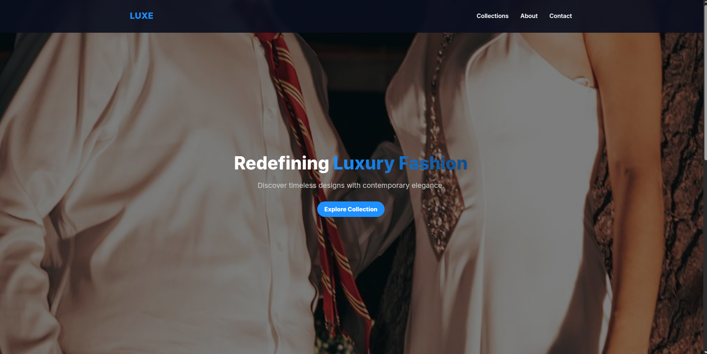
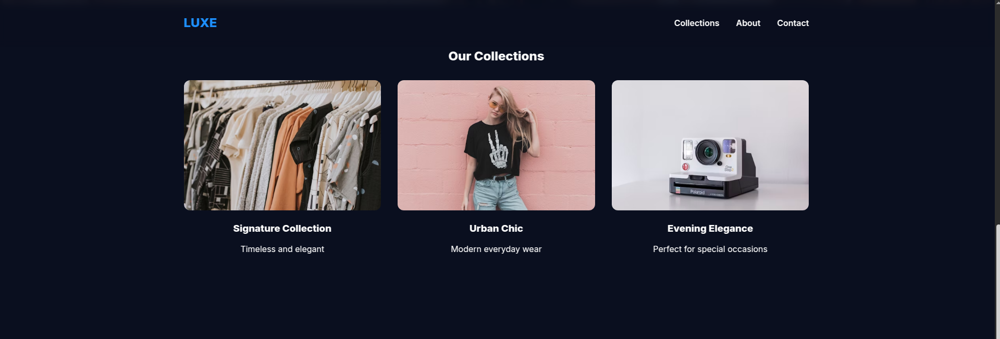

# 👗 LUXE – Fashion Brand Landing Page

A **modern fashion landing page** built with **pure HTML, CSS, and JavaScript**.  
Designed with a **dark blue luxury theme**, smooth animations, responsive layout, and interactive elements to give the feel of a premium fashion brand.

## 🌐 Live Demo
👉 [View Demo](https://landing-rho-red.vercel.app/)  

## 🚀 Features
- 🎨 **Full-screen Hero Section** with a high-quality fashion background
- 📱 **Responsive Navigation Bar** with smooth mobile menu toggle
- 🔗 **Smooth Scrolling** for internal links
- 🖼️ **Collections Showcase** with hover zoom effect
- 💌 **Newsletter Subscription Form** with interactive success state
- 🌙 **Dark Blue Gradient Theme** for a luxury aesthetic

## 📸 Screenshots

### 🏠 Hero Section

### 👜 Collections Section

### 📱 Mobile Menu

## 🛠️ Tech Stack
- **HTML5** – semantic structure
- **CSS3** – Flexbox, Grid, media queries, smooth animations
- **Vanilla JavaScript** – mobile nav toggle, smooth scroll, form interaction
- **PixlBay/Unsplash Images** – modern high-quality fashion backgrounds
